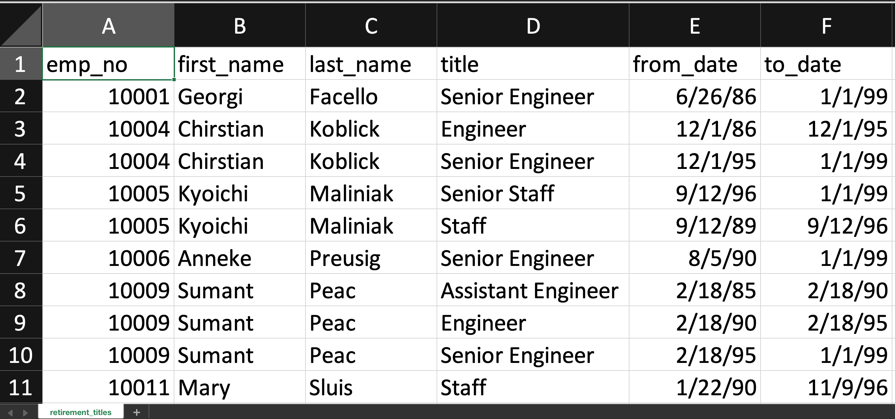
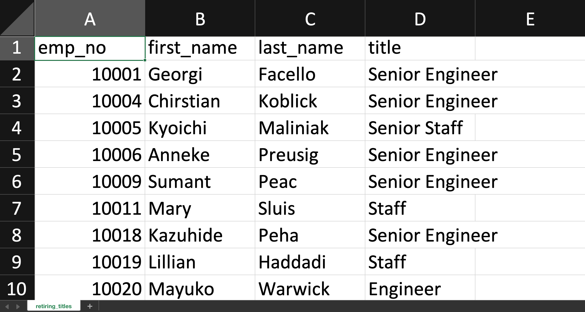
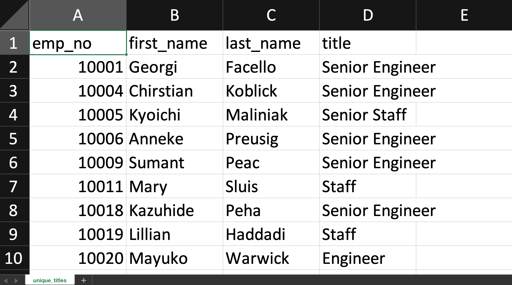
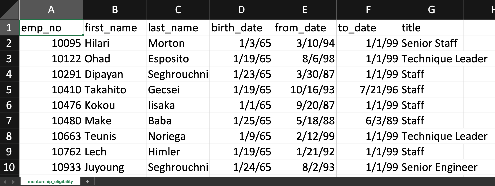
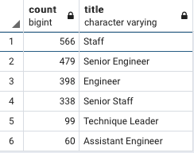
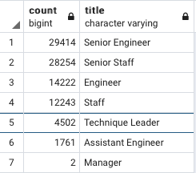

# Pewlett-Hackard-Analysis
## Mentorship Program
# Overview
In this project we help our manager at Pewlett Hackard to create a data table of eligible retiring employees to
be candidates for a developing Senior Mentorship Program.

Our goal was to see if we would have enough candidates for the program and to gain prospects to pitch the idea to.
We used various SQL queries to create new tables, filter, group, order and join the datasets to achieve our final desired dataset.

# Results
Through our analysis we created four new tables:
- retirement_titles, we created this dataset to show all the titles by employee number.

- retiring_titles, this table show the data of all the titles for each retiring employee.

- unique_titles, this table removes any duplicates of employees by using the DISTINCT ON statement.

- mentorship_eligibility, this table shows all employees that are retirement ready and elibible for the mentorship program.

# Summary
## Insight On The "Silver Tsunami"

How many roles will need to be filled as the "silver tsunami" begins to make an impact?

- According to our data a total of 1,940 employees will be retiring and eligible for the mentorship program. All 1,940 positions will need to filled. Below is a detailed table of how many retirees there will be by title.

Are there enough qualified, retirement-ready employees in the departments to mentor the next generation of Pewlett Hackard employees?

- In comparison to all employees and their unique titles, I would say there are enough retirement ready employees in all deparments to mentor the next generation of Pewlett Hackard employees. If we review the tables in the images below
the numbers look very out of proportion and we can also see that there will be no retiring employees in the Manager position but only two managers with unique titles. Depending on how the program is ran, I believe it is managable.

After some easy math we can figure the proportions per position, as listed below:

Each Staff retiree must mentor about 22 incoming employees.

Each Senior Staff retiree must mentor about 84 incoming employees.

Each Engineer retiree must mentor about 36 incoming employees.

Each Assistant Engineer retiree must mentor about 29 incoming employees.

Each Senior Enginner retiree must mentor about 61 incoming employees.

Each Technique Leader retiree must mentor about 45 incoming employees.

As a class mentorship program I find it possible, but as a 1:1 mentorship program it would be impossible.
